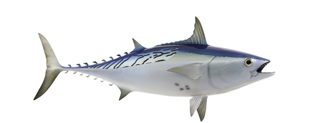

## _Markdown_

_Markdown_ es un lenguaje de marcado que sirve para definir contenido.Es muy usado para documentar proyectos de _software_, es el estandar en el que se redacta la documentacion.
Tambien es utilizado para crear contenido estatico que posteriormente se pueda compilar a codigo _HTML_.

## indice de contenido

- [Introduccion](#markdown)
- [Parrafo](#parrafo)
- [Negritas-y-cursivas](#parrafo)


## parrafo

Un parrafo es una extension de texto que funciona cuando hay un salto de line (enter) en el documento.

Este seria otro parrafo.

## Negritas y Cursivas
En Markdown podemos escribir con **negritas** para escribir en _cursiva_.

_**Este texto esta en cursiva y en negritas**_.

# Encabezado de nivel 1

## Encabezado de nivel 2

### Encabezado de nivel 3

#### Encabezado de nivel 4

##### Encabezado de nivel 5

###### Encabezado de nivel 6



[litteTunny](https://proangler.us/fishdirectory/bonito-little-tunny/)

Imagen con link
[!](Imagen Random)
[Youtube]()

[ir al encabezado 1](#encabezado-de-nivel-1)

[Ir al archivo img](markdown-intro.md)

Esta es otra seccion, la linea de arriba se llama **division**

## Listas
- Primavera 
    - Marzo
    - Abril
    - Mayo
- Verano
- Otoño
- Invierno

1. Primavera
2. Verano
3. Otoño
4. Invierno

## Citas

### Cita en una linea
> Yo solo se que no se nada
> Todo loque escuchamos es una opinion 
> Todo lo que vemos es una pespectiva no la verdad
>
>-Marco Aurelio

## Tablas
| Pais | Ciudad | Continente |
| -----| ------ | ---------- |
|Mexico| CDMX   | AMERICA

## Codigo

### Bloques de codigo
```js
function sumar(a,b){
if(){}
}

```
### Codigo HTML

<form>
<label for="q">Buscar.<label>
</form>

### Comentarios

ALT+SHIFT+A = COMENTAR


### Escape de caracteres

\_cursiva\_
\*\*negrita\*\*
\\

[☝🏻 Regresar](#markdown)

---